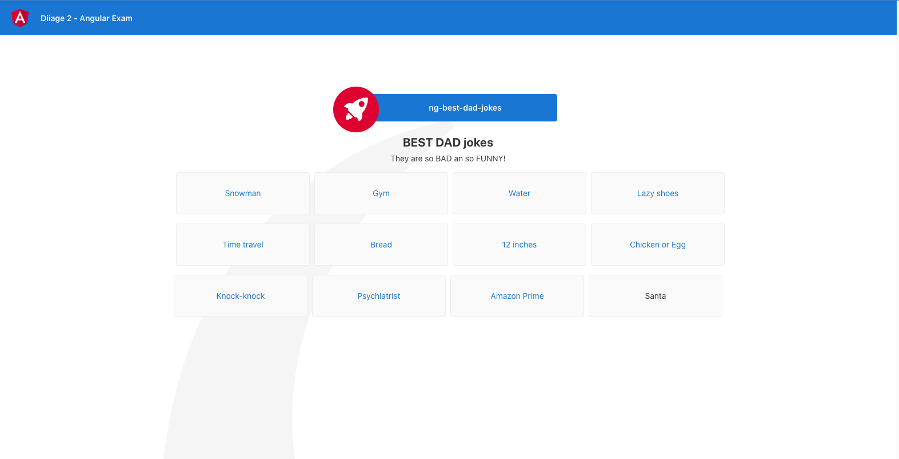

# Best DAD jokes

**Sujet** : Créer un site SPA, pour mettre en avant les meilleures Joke de Papa.



# Préparation de l'environnement de dev (5 minutes)
- **Forker** le repository Github du front end : https://github.com/bratosab/jokes-de-papa-ng-15 vers votre compte Github
- **Cloner** votre repo en local sur votre poste pour travailler dessus
- **Installer** les dépendances `npm` et **lancer** le projet (Infos projet à la fin du readme)
- **Cloner** le repository Github du back end : https://github.com/bratosab/api-best-dad-jokes
- **Installer** les dépendances `npm` et **lancer** le projet (Voir readme du projet API)

# Partie 1 - Service (15 minutes)
Les données utilisées par l'application sont actuellement directement dans un fichier mock: `/src/app/data/posts.mock.ts`, on souhaiterais les récuperer dynamiquement de l'API suivante :
```js
// Un simple GET retourne tous les posts
this.httpClient.get('http://localhost:3001/posts')
``` 
  1. Ajouter un service qui vous permettera de faire l'appel HTTP nécessaire
  2. Coder l'appel vers l'api en utilisant HttpClient
  3. Injecter votre service aux emplacements où le mock est utilisé
  4. Brancher les données venant du service (ne pas oubliez de gérer un spinner/message de chargement)
-  **Comiter** votre code avec le commentaire `feat(partie 1): Service`.

# Partie 2 - Routing (10 minutes)
Sur la page d'un post affichant une blague (ex: `http://localhost:4200/post/2`):
1. Une liste de recommandation de blagues s'affiche, le click mets bien à jour le routing (URL de la page), mais ne déclanche pas la mise à jour de la page avec la nouvelle blague choisi dont l'id est maintenant dans l'URL. 
- Réparer le fonctionnement attendu : la blague affiché doit correspondre a l'id dans la route (docs : https://angular.io/guide/router#getting-route-information)
2. La route pour visualiser un post est actuellement de la forme `/post/:id`, changer se fonctionnement pour utiliser la propriété `slug` à la place de l'ID technique des entités Posts, pour avoir une route ressemblant à `/post/chickenegg` par exemple.
- **Comiter** votre code avec le commentaire `feat(partie 2): Routing`

# Partie 3 - Pipe (10 minutes)
Sur la page d'un post affichant une blague (ex: `http://localhost:4200/post/chickenegg`), une liste de recommandation de blagues s'affiche ainsi que la blague que nous sommes déja en train de visualiser.
1. Ecrire un Pipe Angular pour permettre de filtrer la liste des blagues recommender et éviter d'afficher la blague en cours d'affichage. (Docs : https://angular.io/guide/pipes#creating-pipes-for-custom-data-transformations)
- **Comiter** votre code avec le commentaire `feat(partie 3): Pipe`

# Pour finir (1 minute)

- Vérifier que votre code est bien **PUSHER** sur Github pour qu'il soit visible
- Envoyer le lien du repo ou votre username Github à @Abdallah et @Gaultier

# Les liens

- Code Front : https://github.com/bratosab/jokes-de-papa-ng-15
- Code API : https://github.com/bratosab/api-best-dad-jokes 
- Swagger api : http://localhost:3001/explorer/


## Vous avez 45 minutes, bon courage !
-----
# Informations supplémentaires : projet Angular JokesDePapaNg15

This project was generated with [Angular CLI](https://github.com/angular/angular-cli) version 15.2.0.

## Development server

Run `npm run start` or `ng serve` for a dev server. Navigate to `http://localhost:4200/`. The app will automatically reload if you change any of the source files.

## Code scaffolding

Run `ng generate component component-name` to generate a new component. You can also use `ng generate directive|pipe|service|class|guard|interface|enum|module`.

## Build

Run `ng build` to build the project. The build artifacts will be stored in the `dist/` directory.

## Running unit tests

Run `ng test` to execute the unit tests via [Karma](https://karma-runner.github.io).

## Running end-to-end tests

Run `ng e2e` to execute the end-to-end tests via a platform of your choice. To use this command, you need to first add a package that implements end-to-end testing capabilities.

## Further help

To get more help on the Angular CLI use `ng help` or go check out the [Angular CLI Overview and Command Reference](https://angular.io/cli) page.
